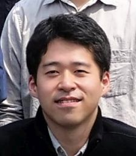

## 所属・連絡先

東京大学 大学院新領域創成科学研究科 複雑理工学専攻 
篠田・牧野研究室 特任助教 
〒277-8561 千葉県柏市柏の葉5-1-5 
新領域基盤棟3E3号室 
ORCID: https://orcid.org/0000-0002-5042-1773 
mail: Masahiro_Fujiwara@ipc.i.u-tokyo.ac.jp

## 経歴

|  |  |
| :--- | :--- |
| Mar. 2018 – | 東京大学 大学院新領域創成科学研究科 複雑理工学専攻 特任助教 |
| Jul. 2017 – Mar. 2018 | 東芝インフラシステムズ株式会社 |
| Apr. 2015 – Jun. 2017 | 株式会社東芝 |
| Apr. 2013 – Mar. 2015 | 日本学術振興会 特別研究員 DC2 |
| Apr. 2012 – Mar. 2015 | 東京大学 大学院情報理工学系研究科 システム情報学専攻 博士課程 |
| Apr. 2010 – Mar. 2012 | 東京大学 大学院情報理工学系研究科 システム情報学専攻 修士課程 |
| Apr. 2007 – Mar. 2010 | 東京大学 工学部 計数工学科 システム情報工学コース |
| Apr. 2002 – Mar. 2007 | 国立津山工業高等専門学校 電子制御工学科 |

## 所属学会

- 計測自動制御学会

## 研究業績

### 原著論文

- 藤原 正浩，篠田 裕之: 集束超音波を用いた表面硬さ分布の遠隔計測，計測自動制御学会論文集，Vol. 49, No. 4, pp. 455-460, Apr. 2013. (計測自動制御学会計測部門論文賞）

### 国際会議（査読有）

- Masahiro Fujiwara, Yu Someya, Yasutoshi Makino, Hiroyuki Shinoda, "Reflection Pattern Sensing for Valid Airborne Ultrasound Tactile Display," Proc. 2021 IEEE World Haptics Conference (WHC), pp. 121-126, Montreal, Canada, Jul. 6-9, 2021.（Best Technical Paper Award）
- Masahiro Fujiwara, Yasutoshi Makino, and Hiroyuki Shinoda, "Three-dimensional Ultrasound Sensing for Aerial Tactile Display," in IEEE 59th Annual Conference of the Society of Instrument and Control Engineers of Japan (SICE2020), FrBT14.5, pp. 706-708, Chiang Mai, Thailand (Online), Sep. 23-26, 2020.
- Yasuaki Monnai, Keisuke Hasegawa, Masahiro Fujiwara, Seki Inoue, and Hiroyuki Shinoda, "HaptoMime: Mid-Air Haptic Interactions with a Floating Virtual Screen," Proc. 27th ACM User Interface Software and Technology Symposium (UIST 2014), Hawaii, USA, Oct. 2014.（People's Choice Best Demo Award）
- Masahiro Fujiwara and Hiroyuki Shinoda, "Preliminary Study on Noncontact Internal Structure Sensing by Resonant Mode Excitation Using Airborne Ultrasound Radiation Pressure," Proc. SICE Annual Conference 2014, FrBT5.2, Sapporo, Japan, Sep. 9-12, 2014.
- Masahiro Fujiwara and Hiroyuki Shinoda, "Coaxial Noncontact Surface Compliance Distribution Measurement for Muscle Contraction Sensing," Proc. 2014 IEEE Haptics Symposium, Houston, TX, USA, pp. 385-389, Feb. 23-26, 2014.
- Masahiro Fujiwara and Hiroyuki Shinoda, "Continuous Scanning Measurement of Surface Compliance Distribution from Remote Position Using Rotated Mirror," Proc. SICE Annual Conference 2013, pp. 818-821, Nagoya, Japan, Sep. 14-17, 2013.
- Masahiro Fujiwara and Hiroyuki Shinoda, "Noncontact Human Force Capturing Based on Surface Hardness Measurement," Proc. 2013 IEEE World Haptics Conference, pp. 85-90, Daejeon, Korea, Apr. 14-18, 2013.
- Masahiro Fujiwara and Hiroyuki Shinoda, "Remote Measurement Method of Surface Compliance Distribution for a Curved Surface Object," Proc. SICE Annual Conference 2012, pp. 1-5, Tokyo, Japan, Aug. 20-23, 2012.（学術・研究奨励賞）
- Masahiro Fujiwara, Kei Nakatsuma, and Hiroyuki Shinoda, "Remote Measurement of Surface Compliance Distribution for Haptic Broadcasting," Proc. SICE Annual Conference 2011, pp. 1960-1965, Tokyo, Japan, Sep. 13-18, 2011.
- Keiko Yokoyama, Kei Nakatsuma, Masahiro Fujiwara, Masafumi Takahashi and Hiroyuki Shinoda, "Remote Compliance Measurement Method Using Ultrasound Phased Array," Proc. SICE Annual Conference 2011, pp. 2397-2401, Tokyo, Japan, Sep. 13-18, 2011.
- Masahiro Fujiwara, Kei Nakatsuma, Masafumi Takahashi, and Hiroyuki Shinoda, "Remote Measurement of Surface Compliance Distribution Using Ultrasound Radiation Pressure," Proc. 2011 IEEE World Haptics Conference, pp. 43-47, Istanbul, Turkey, Jun. 21-24, 2011.

### 国内会議

- 狭川 正稔, 藤原 正浩, 牧野 泰才, 篠田 裕之, "空中超音波触覚提示の強度分布センシング," 第32回日本機械学会ロボティクス・メカトロニクス講演会（ROBOMECH2020）, 金沢（オンライン）, May 2020.
- 藤原 正浩, 牧野 泰才, 篠田 裕之, "空中超音波触覚ディスプレイの騒音抑制による触知覚への影響," 第20回計測自動制御学会システムインテグレーション部門講演会（SI2019）, 2A2-02, 香川, Dec. 2019.
- 藤原 正浩, 牧野 泰才, 篠田 裕之, "空中音響放射圧を用いた振動励起に基づく弾性体構造計測," 第15回計測自動制御学会システムインテグレーション部門講演会（SI2014）, pp. 1804-1807, 3A2-3, 東京, Dec. 2014.
- 藤原 正浩, 篠田 裕之, "集束超音波と変位測定の同軸化による非接触表面硬さ分布計測の高精度化," 第14回計測自動制御学会システムインテグレーション部門講演会（SI2013）, pp. 654-655, 1I2-5, 神戸, Dec. 2013.
- 藤原 正浩, 篠田 裕之, "音響放射圧を用いた表面硬さ計測に基づく非接触筋収縮センシング," 第30回センシングフォーラム計測部門大会, pp. 110-113, 1C1-2, 長野, Aug. 2013.
- 藤原 正浩, 貝田 龍太, 篠田 裕之, "多人数への物体の触力覚情報伝送のための硬さモデル生成（第3報）レーザーの回転ミラー走査による変位分布測定を用いた表面硬さ分布計測の高速化," 第25回日本機械学会ロボティクス・メカトロニクス講演会（ROBOMEC2013）, 2A2-P26, 茨城, May 2013.
- 藤原 正浩, 篠田 裕之, "時間変調移動荷重を用いた単一走査表面硬さ分布計測," 第13回計測自動制御学会システムインテグレーション部門講演会（SI2012）, pp. 307-310, 1D2-1, 福岡, Dec. 2012.
- 藤原 正浩, 篠田 裕之, "曲面形状をもつ実物体の遠隔表面硬さ分布計測," 第29回「センサ・マイクロマシンと応用システム」シンポジウム, pp. 208-212, 2E2-2, 福岡, Oct. 2012.
- 藤原 正浩, 篠田 裕之, "1次元変位センサによる遠隔表面硬さ分布計測の高速化," 第29回センシングフォーラム計測部門大会, pp. 139-142, 1C1-3, 茨城, Sep. 2012.
- 藤原 正浩, 中妻 啓, 篠田 裕之, "触覚共有のための表面硬さ分布の非接触計測と提示," 第12回計測自動制御学会システムインテグレーション部門講演会（SI2011）, pp. 610-613, 1I1-4, 京都, Dec. 2011.
- 藤原 正浩, 中妻 啓, 篠田 裕之, "触覚放送のための表面硬さ分布の遠隔計測と物体モデルの提示に関する研究," 第28回センシングフォーラム計測部門大会, pp. 149-152, 1C2-4, 東京, Oct. 2011.（研究・技術奨励賞）
- 藤原 正浩, 中妻 啓, 篠田 裕之, "多人数への同時触力覚情報伝送のための表面硬さ分布の遠隔計測と提示に関する研究," 第28回「センサ・マイクロマシンと応用システム」シンポジウム, pp. 206-209, D3-4, 東京, Sep. 2011.
- 藤原 正浩, 横山 恵子, 中妻 啓, 篠田 裕之, "多人数への物体の触力覚情報伝送のための硬さモデル生成（第2報）触力覚三次元モデルの生成と提示," 第23回日本機械学会ロボティクス・メカトロニクス講演会（ROBOMEC2011）, 2A2-O08, 岡山, May 2011.
- 横山 恵子, 中妻 啓, 藤原 正浩, 高橋 将文, 篠田 裕之, "多人数への物体の触力覚情報伝送のための硬さモデル生成（第1報）超音波振動子アレイを用いた表面硬さ分布計測システム," 第23回日本機械学会ロボティクス・メカトロニクス講演会（ROBOMEC2011）, 2A2-O07, 岡山, May 2011.
- 藤原 正浩, 中妻 啓, 篠田 裕之, "超音波音響放射圧を用いた非接触表面硬さ分布計測法," 第11回計測自動制御学会システムインテグレーション部門講演会（SI2010）, pp. 145-148, 1C1-4, 仙台, Dec. 2010.
- 藤原 正浩, 芳賀 達也, 鈴木 隆文, 満渕 邦彦, "培養神経細胞を用いた刺激パターンの学習に関する研究 ―高頻度電気刺激によるスパイク発火頻度の時間的分布変化を用いた学習―", 第25回生体・生理工学シンポジウム, 2A1-4, 岡山, Sep. 2010.
- 藤原 正浩, 原 辰次, 田中 英明, "PD制御による倒立振子の協調安定化可能性," 第52回自動制御連合講演会, I5-2, pp. 1-6, 大阪, Nov. 2009.

### デモ

- Yasuaki Monnai, Keisuke Hasegawa, Masahiro Fujiwara, Kazuma Yoshino, Seki Inoue, Hiroyuki Shinoda, "Adding Texture to Aerial Images Using Ultrasounds," AsiaHaptics 2014.（Honorable Mention）
- Keisuke Hasegawa, Yasuaki Monnai, Masahiro Fujiwara, Kazuma Yoshino, and Hiroyuki Shinoda, "An Aerial Vibrotactile Display with Floating Visual Images," IEEE World Haptics Conference 2013, D1-18, Daejeon, Korea, Apr. 14-18, 2013.

## 受賞等

- The winner of the award for Best Technical Paper, WHC21（2021.7.9）
- People's Choice Best Demo Award, UIST2014（2014.10.8）
- Honorable Mention of Best Demonstration Award, AsiaHaptics 2014（2014.11.20）
- 2012年度計測自動制御学会学会賞 学術奨励賞・研究奨励賞（SICE Annual Conference 2012）（2013.2.22）
- 2011年度計測自動制御学会計測部門 研究・技術奨励賞（第28回SICEセンシングフォーラム）（2012.9.28）
- 第18回全国高等専門学校ロボットコンテスト2005 優勝（2005.12.4）

## 資格等

- 第一種普通自動車運転免許
- 第三種電気主任技術者
- 乙種第4類危険物取扱者
- 3級機械設計技術者
- 第1種陸上無線技術士
- 産業用ロボットの教示等の業務に係る特別教育修了（2018.8.24）
