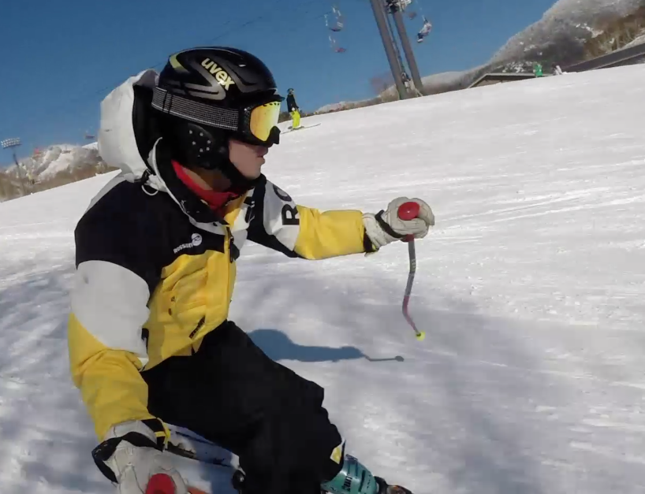

## 連絡先

東京大学 大学院情報理工学系研究科 システム情報学専攻 
篠田・牧野研究室 
〒113-8656 東京都文京区本郷7-3-1 
工学部14号館622号室 
mail: inoue@hapis.k.u-tokyo.ac.jp

## 経歴

|  |  |
| :--- | :--- |
| Oct. 2020 – | 東京大学新領域創成科学研究科 特任研究員 |
| Sep. 2016 – | UNICORN株式会社 Top Data Scientist |
| Apr. 2015 – Aug. 2016 | 日本学術振興会 特別研究員（DC1） |
| Apr. 2015 – Mar. 2018 | 東京大学大学院 情報理工学系研究科 システム情報学専攻 博士課程 |
| Oct. 2014 – Mar. 2015 | [Mist Technologies株式会社](http://www.mist-t.co.jp/) CTO |
| Apr. 2013 – Mar. 2015 | 東京大学大学院 情報理工学系研究科 システム情報学専攻 修士課程 |
| Jan. 2013 – Mar. 2015 | [Intellectual Backyard株式会社](http://www.intelback.com/) 代表取締役社長 |
| Apr. 2012 – Jun. 2013 | [株式会社ユニプロ](http://unipro.co.jp/) 取締役 |
| Nov. 2011 – Mar. 2012 | 株式会社ユニプロ 執行役員 |
| Apr. 2011 – Mar. 2013 | 東京大学 工学部 計数工学科 |
| Apr. 2009 – Mar. 2011 | 東京大学 教養学部 理科一類 |
| Apr. 2006 – Mar. 2009 | 静岡県立静岡高等学校 |

## 研究業績

### 原著論文

1. [Seki Inoue, Shinichi Mogami, Tomohiro Ichiyama, Akihito Noda, Yasutoshi Makino, and Hiroyuki Shinoda: "Acoustical Boundary Hologram for Macroscopic Rigid-Body Levitation," J. Acoust. Soc. Am. 145, 328-337 (2019).](https://asa.scitation.org/doi/10.1121/1.5087130)

### 受賞

1. Best Demo Award, IEEE WHC 2015 — Seki Inoue, Yasutoshi Makino and Hiroyuki Shinoda: "Active Touch Perception Produced by Airborne Ultrasonic Haptic Hologram"
2. 研究科長賞, 2015, 東京大学大学院情報理工学系研究科
3. SICE Annual Conference International Award of the SICE2014 — Seki Inoue, Yasutoshi Makino and Hiroyuki Shinoda: "An Airborne Ultrasonic 3D Tactile Image by Time Reversal Field Rendering", 2014 IEEE SICE Annual Conference, Hokkaido, Japan, Sep. 2014
4. People's Choice Best Demo Award — Yasuaki Monnai, Keisuke Hasegawa, Masahiro Fujiwara, Kazuma Yoshino, Seki Inoue and Hiroyuki Shinoda, "HaptoMime: Mid-Air Haptic Interactions with a Floating Virtual Screen", the 27th Annual ACM Symposium on User Interface Software and Technology, UIST '14, Hawaii, USA, Oct. 5-8, 2014
5. Honorable Mention of Best Demonstration Award, AsiaHaptics 2014 — Yasuaki Monnai, Keisuke Hasegawa, Masahiro Fujiwara, Kazuma Yoshino, Seki Inoue, Hiroyuki Shinoda, "Adding Texture to Aerial Images Using Ultrasounds"
6. 経済産業省 Innovative Technologies 2014, Industry 特別賞
7. ACM SIGGRAPH Special Prize in Digital Content EXPO 2014

### 国際会議（査読有）

1. Seki Inoue, Yasutoshi Makino and Hiroyuki Shinoda: "Mid-Air Ultrasonic Pressure Control on Skin by Adaptive Focusing", EuroHaptics 2016
2. Yasutoshi Makino, Yoshikazu Furuyama, Seki Inoue and Hiroyuki Shinoda: "Mutual Tele-Environment: Realtime 3D Image Transfer with Force Feedback", ACM CHI 2016
3. [Seki Inoue, Yasutoshi Makino and Hiroyuki Shinoda: "Active Touch Perception Produced by Airborne Ultrasonic Haptic Hologram", 2015 IEEE World Haptics Conference](https://drive.google.com/file/d/1bvZg-uldmHakDNDBW4rOjlQ_G15p1tQF/view?usp=drive_link)
4. [Seki Inoue and Hiroyuki Shinoda: "A Pinchable Aerial Virtual Sphere by Acoustic Ultrasound Stationary Wave", 2014 IEEE Haptics Symposium Proceedings, Houston, Texas, Feb. 2014.](http://ieeexplore.ieee.org/xpl/articleDetails.jsp?tp=&arnumber=6775437)
5. [Seki Inoue, Koseki Kobayashi Kirschvinkand, Yasuaki Monnai, Keisuke Hasegawa, Yasutoshi Makino and Hiroyuki Shinoda: "HORN: The Hapt-Optic Reconstruction", 2014 ACM SIGGRAPH Emerging Technologies, Vancouver, Canada, Aug. 2014.](http://dl.acm.org/citation.cfm?id=2614092)
6. Seki Inoue, Yasutoshi Makino and Hiroyuki Shinoda: "An Airborne Ultrasonic 3D Tactile Image by Time Reversal Field Rendering", 2014 IEEE SICE Annual Conference, Hokkaido, Japan, Sep. 2014
7. Yasuaki Monnai, Keisuke Hasegawa, Masahiro Fujiwara, Kazuma Yoshino, Seki Inoue and Hiroyuki Shinoda, "HaptoMime: Mid-Air Haptic Interactions with a Floating Virtual Screen", the 27th Annual ACM Symposium on User Interface Software and Technology, UIST '14, Hawaii, USA, Oct. 5-8, 2014
8. Seki Inoue, Yasutoshi Makino, Hiroyuki Shinoda: "Designing Stationary Airborne Ultrasonic 3D Tactile Object", 2014 IEEE/SICE International Symposium on System Integration, Tokyo, Japan, Dec. 13-15, 2014

### 国内学会

1. 井上 碩, 篠田 裕之: 空中超音波の定在波を利用した触覚ディスプレイ, 第18回日本バーチャルリアリティ学会大会論文集, pp. 468-469
2. 井上 碩, 奥村 光平, 奥 寛雅, 石川 正俊: 自由運動する球面鏡の高速高解像度トラッキングによる動的な周囲環境イメージング, 第17回日本バーチャルリアリティ学会大会論文集, pp. 519-522

## 学位論文

- 【修士論文】超音波音場の制御による定在空中立体触覚像の提示（篠田牧野研究室）
- 【卒業論文】SRAM/MRAMハイブリッドキャッシュにおける共有状態に着目したデータ配置手法（中村研究室）

## その他学術誌

1. ACM Interactions 2015 Vol. XXII.2 "Demo Hour", p. 8

## 特許等

1. サーバ装置（特許第5483244号）

## 資格等

- May 2017 産業用ロボットの教示等の業務に係る特別教育修了
- Nov. 2004 危険物取扱者乙種第六類
- Nov. 2004 危険物取扱者乙種第五類
- Jul. 2004 危険物取扱者乙種第四類
