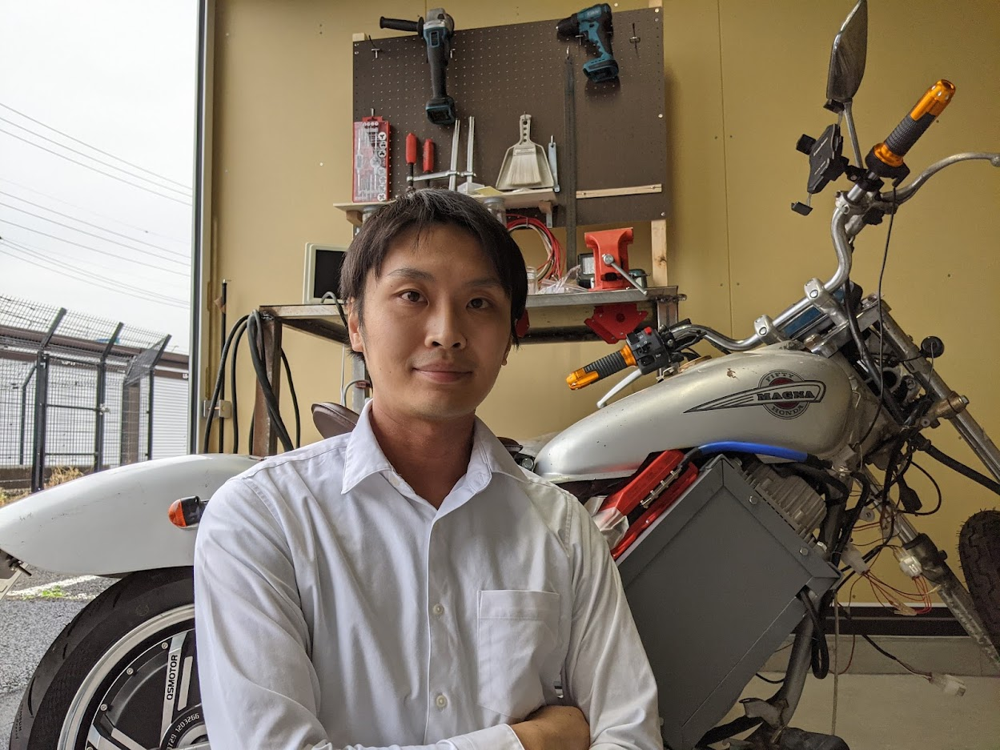

## 所属・連絡先

東京大学 大学院新領域創成科学研究科 複雑理工学専攻 
篠田・牧野研究室 特任研究員 
〒277-8561 千葉県柏市柏の葉5-1-5 
新領域基盤棟3E3号室 
mail: masuda@hapis.k.u-tokyo.ac.jp

## 経歴

|  |  |
| :--- | :--- |
| Apr. 2019 – 	 | 東京大学大学院新領域創成科学研究科複雑理工学専攻 特任研究員 |
| Apr. 2016 – Mar. 2019 	| 東京大学大学院新領域創成科学研究科複雑理工学専攻 博士課程 |
| Apr. 2014 – Mar. 2016 	| 東京大学大学院新領域創成科学研究科複雑理工学専攻 修士課程 |
| Apr. 2010 – Mar. 2014 	| 立命館大学理工学部ロボティクス学科 |
| Apr. 2007 – Mar. 2010 	| 香川県立高松西高校 |

## 所属学会

- 電子情報通信学会

## 研究業績

### 受賞

- 2020年度 短距離無線通信研究会 研究奨励賞
- 増田 祐一，平野 義明（帝人），根岸 毅人（帝人），篠田裕之
- Best Student Award WiPoT award (best of best), AWPT 2020 (Asia Wireless Power Transfer Conference 2020)
- Yuki Matsuzaki, Yuichi Masuda, Masahiro Fujiwara, Yasutoshi Makino, and Hiroyuki Shinoda
- 2016年度 短距離無線通信研究会 論文賞
- 野田 聡人, 増田 祐一, 篠田 裕之：二次元通信タイルを介した微弱無線相当の高速室内ネットワーク, 電子情報通信学会技術研究報告 SRW, SRW2016-25, pp.21-26, 横須賀, June 2016.
- 2016年度 短距離無線通信研究会 優秀学生賞
- 増田 祐一, 野田 聡人, 篠田 裕之：二次元通信環境における高速・省電力信号伝送のための物理層設計, 電子情報通信学会技術研究報告 SRW, SRW2016-68, pp.1-6, 東京工業大学 大岡山キャンパス , March 2017.
- 研究科長賞, 2016, 東京大学大学院新領域創成科学研究科.
- SICE Annual Conference Young Author’s Award, 2015.
- Yuichi Masuda, Akihito Noda, and Hiroyuki Shinoda: Contactless Coupler for 2D Communication Tile Connection, Proc. SICE Annual Conference 2015, pp.522-527, July 28-30, Hangzhou, China, 2015.
- 第15回 SICE SI2014 優秀講演賞 （増田祐一、野田聡人、岡田明正、牧野泰才、篠田裕之）

### 学術論文

- [[J-STAGE](http://doi.org/10.1587/comex.2016XBL0077)] Yuichi Masuda，Akihito Noda and Hiroyuki Shinoda: “A low power and high speed data transmission system based on 2D communication”, IEICE Communications Express (ComEX), vol. 5, no. 9, pp. 322-328, July 2016.(Acceptance Rate: 42.9%)

### 国際会議（査読有）

- Y. Masuda, N. Takahashi, K. Hata, H. Shinoda, “A Waveguide Power Transfer for Electric Vehicles in Motion,”International Electric Vehicle Technology Conference (EVTeC), 2025. (to be presented)
- [[PDF](http://hapislab.org/wp-content/uploads/2025/04/IECIN2024_YuichiMasuda.pdf)] Y. Masuda and H. Shinoda, “A magnetically coupled 2-D waveguide power transfer,” IECON 2024 – 50th Annual Conference of the IEEE Industrial Electronics Society, Chicago, IL, USA, 2024, pp. 1-6, doi: 10.1109/IECON55916.2024.10905181.
- Y. Masuda, Y. Sakai, K. Kosya, K. Sakamoto, L. Uesaka, K. Sato, Y. Makino and H. Shinoda, “Wireless Power Transfer System for Biologging Terminals within the Nest Box,” in nternational Symposium on Hierarchical Bio-Navigation, The Univ. of Tokyo, Tokyo, March 11-12, 2024.
- [[PDF](https://hapislab.org/wp-content/uploads/sites/7/2021/01/Yuichi-Masuda_AWPT2020_Draft.pdf)] Yuichi Masuda, Yoshiaki Hirano, Tsuyoto Negishi, Hiroyuki Shinoda, “2-D waveguide power transfer operating at 6.78 MHz with a meander surface sheet,” in Asia Wireless Power Transfer Conference (AWPT2020), Taipei, Taiwan (Online), Dec. 16-18,2020.
- [[PDF](http://hapislab.org/wp-content/uploads/2018/07/IEEE-EMBC2018-masuda-draft.pdf)] Yuichi Masuda, Akihito Noda and Hiroyuki Shinoda: “Body Sensor Networks by an NFC-coupled Smartphone in the Pocket,” 2018 40th Annual International Conference of the IEEE Engineering in Medicine and Biology Society (EMBC), SaBT5, Honolulu, USA, June 17-21, 2018.
- [[PDF](http://hapislab.org/public/papers/18_BSN2018_masuda.pdf)] Yuichi Masuda, Akihito Noda, Hiroyuki Shinoda, “Whole Body Human Power-Based Energy Harvesting using a Conductive Embroidered Cloth and a Power Aggregation Circuit, ” in Proc. IEEE 15th International Conference on Wearable and Implantable Body Sensor Networks (BSN), pp. 214-217, March 4-7, 2018, Las Vegas, USA.(Acceptance Rate: 43.5%)
- [[PDF](http://hapislab.org/public/papers/17_SII2017_masuda.pdf)] Yuichi Masuda, Akihito Noda, Hiroyuki Shinoda, “Power Aggregation from Multiple Energy Harvesting Devices Via a Conductive Embroidered Cloth,” in Proc. 2017 IEEE/SICE International Symposium on System Integration, pp. 553-558, Dec. 11-14, 2017, Taipei, Taiwan.(Acceptance Rate: 73.5%)
- [PDF] Yuichi Masuda, Akihito Noda, Hiroyuki Shinoda, “Physical Layer Design of Energy-Efficient Data
- Transmission in 2D Communication Environments,” in Proc. IEEE VTC fall 2017, pp. 1-5, Sep. 24-27, 2017, Toronto, Canada.(Acceptance Rate: 56.4%)
- [[PDF](http://hapislab.org/public/papers/16_CCNC_noda.pdf)] [デモ] Akihito Noda, Akimasa Okada, Yudai Fukui, Yuichi Masuda and Hiroyuki Shinoda, “Massive Multiple Access Wireless LAN Using Ultra-Wideband Waveguide Floor Tiles,” in Proc. the 2016 13th Annual IEEE Consumer Communications and Networking Conference (CCNC), pp. 279-280, Las Vegas, USA, January 9-12, 2016.
- [[PDF](http://hapislab.org/public/papers/15_SICE_masuda.pdf)] Yuichi Masuda, Akihito Noda, and Hiroyuki Shinoda, “Contactless Coupler for 2D Communication Tile Connection,” in Proc. SICE Annual Conference 2015, pp.522-527, July 28-30, Hangzhou, China, 2015. (Acceptance Rate: 71%)

### 国内学会

- 増田祐一，酒井優希，坂本健太郎，牧野泰才，篠田裕之：”バイオロギング端末のための巣箱型ワイヤレス給電システム，” 第42回センシングフォーラム 計測部門大会，pp.91-93，群馬大学，桐生，Sep.25-26，2025．
- 高橋　直也，畑　勝裕，増田　祐一：”85 kHz帯の導波路方式ワイヤレス給電における効率測定,” 令和7年電気学会全国大会，pp.1-2，明治大学，中野，Mar.18-20，2025
- 増田祐一，酒井優希，古謝勝將，坂本健太郎，牧野泰才，篠田裕之：”巣箱型ワイヤレス給電を用いたバイオロギングシステム，” 第66回自動制御連合講演会，pp.461-463，東北大学，仙台，Oct.7-8，2023．
- 増田祐一，酒井優希，牧野泰才，篠田裕之：”オオミズナギドリ用バイオロギング端末のための巣箱型ワイヤレス充電システム，” 第40回センシングフォーラム 計測部門大会，2P1-11，高知工科大学，高知，Aug.31-Sep.1．2023．
- 増田 祐一，古謝 勝將，篠田 裕之：”オオミズナギドリ用バイオロギング端末のための無線給電システムの検討，” 電子情報通信学会 短距離無線研究会 SRW2022-24，p36，機械振興会館，東京，Nov.24-25，2022.
- 増田 祐一，篠田 裕之：”ソレノイド状の波長短縮構造を用いた導波路電力伝送,” 電子情報通信学会 短距離無線研究会 SRW2022-01，pp. 29 – 33，オンライン開催，東京，Jan. 17，2022.
- 増田 祐一，平野 義明，根岸 毅人，篠田 裕之：”ミアンダシートを用いた２次元導波路電力伝送,” 電子情報通信学会 短距離無線研究会 SRW2021-2，pp. 7 – 12，オンライン開催，東京，June 21，2021.
- 増田 祐一，平野 義明，根岸 毅人，篠田 裕之：”シート状導波路を用いた長距離無線電力伝送,” 第52回電子情報通信学会 短距離無線研究会，pp. 63 – 68，東京工業大学 大岡山キャンパス，東京，Mar. 3-5，2020.
- 増田 祐一, 篠田 裕之: “2次元導波路を用いた長距離無線電力伝送,”第20回計測自動制御学会システムインテグレーション部門講演会論文集, pp. 1491-1494, サンポート高松, 香川, Dec. 12-14, 2019.
- 増田 祐一，野田 聡人 and 篠田 裕之: “二次元通信技術を用いた走行中無線給電”, 2018年電子情報通信学会ソサイエティ大会 通信講演論文集1, pp. B-21-17, 金沢大学 角間キャンパス（金沢市角間町）, Sep. 11-14, 2018.
- 増田祐一, 野田聡人, 篠田裕之: ウェアラブル二次元通信シートとNFC対応ホスト端末を用いた
- Batteryless Body Sensor Networks, 電子情報通信学会技術研究報告 SRW 短距離無線通信研究会, SRW2017-70, pp. 25-29, YRP横須賀リサーチパーク, Feb. 2018.
- 増田祐一, 野田聡人, 篠田裕之: ウェアラブル二次元通信を用いた電力集約,  第34回センシングフォーラム 資料, pp. 169-173, Aug. 31- Sep. 1, 2017, 熊本大学・黒髪南地区, 熊本.
- 増田 祐一, 野田 聡人, 篠田 裕之: 二次元通信パッドを用いたTransferJet通信範囲の拡大による近距離高速無線信号伝送, 電子情報通信学会技術研究報告 SRW 短距離無線通信研究会, SRW2017-5, pp. 21-25, 富士通 川崎工場, June 2017.
- 増田 祐一, 野田 聡人, 篠田 裕之: 二次元通信環境における高速・省電力信号伝送のための物理層設計, 電子情報通信学会技術研究報告 SRW 短距離無線通信研究会, SRW2016-68, pp. 1-6, 東京工業大学 大岡山キャンパス , March 2017.
- 増田 祐一, 野田 聡人, 篠田 裕之: 二次元通信環境を活用した高速・微弱電力信号伝送における物理層設計, 第17回計測自動制御学会システムインテグレーション部門講演会論文集, pp. 2323-2328, 札幌, December 2016.
- 増田 祐一, 野田 聡人, 篠田 裕之: 二次元通信環境を用いた高速・微弱電力信号伝送,”第33回センシングフォーラム 資料, pp. 184-187, Sep., 2016, 近畿大学・和歌山キャンパス, 和歌山.
- 増田祐一，野田 聡人, 篠田 裕之: 二次元通信環境における低消費電力・高速無線通信，2016年電子情報通信学会総合大会通信講演論文集2, pp.260, 九州大学伊都キャンパス, 福岡県福岡市, 2016/3/15-18.
- 増田 祐一,野田 聡人, 岡田 明正, 福井 雄大, 篠田 裕之: 二次元通信タイルを介した多視点カメラシステム, 第16回計測自動制御学会システムインテグレーション部門講演会論文集, pp. 216-218, 名古屋国際会議場, 愛知県名古屋市熱田区, December 14-16 2015.
- 増田祐一，野田聡人，篠田裕之: 二次元通信タイル間接続の為の近接カプラの試作，ロボティクス・メカトロニクス講演会(ROBOMECH) 2015,1A1-O04(1)-(4), 2015年5月17-19日
- 増田 祐一, 野田 聡人, 岡田 明正, 牧野 泰才, 篠田 裕之: ２次元通信タイル間接続のための近接コネクタ, 第15回計測自動制御学会システムインテグレーション部門講演会論文集, pp.503-504, 東京ビッグサイト, 東京都江東区, December 2015.

### その他の発表等

- Yuichi Masuda: “A Physical Layer Design of Energy Efficient Data Transmission in 2D Communication Environments”, NAMIS Marathon Workshop, National Tsing Hua University, Hsinchu, Taiwan, December 2016.
- Yuichi Masuda: “Proximity Connector between 2DST Tiles”, NAMIS Marathon Workshop, National Tsing Hua University, Hsinchu, Taiwan, December 2014.

### 学位論文

- 【修士論文】二次元通信タイル間接続のための近接コネクタ (篠田牧野研究室)
- 【卒業論文】運動意図検出のための自己相関関数とHuang-Hilbert変換を用いた脳波解析 (永井・土橋研究室)

## 資格等

- May. 2017. 産業用ロボットの教示等の業務に係る特別教育修了
- Sept. 2012. 普通自動二輪免許
